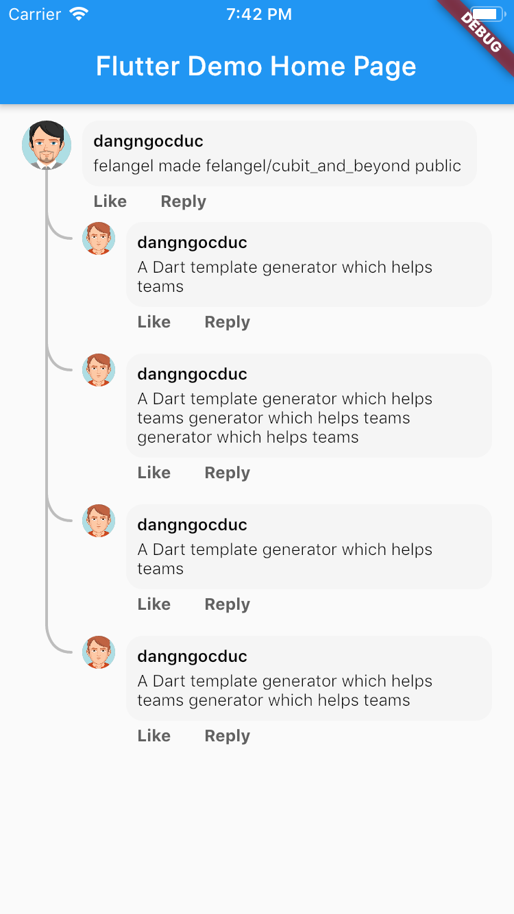
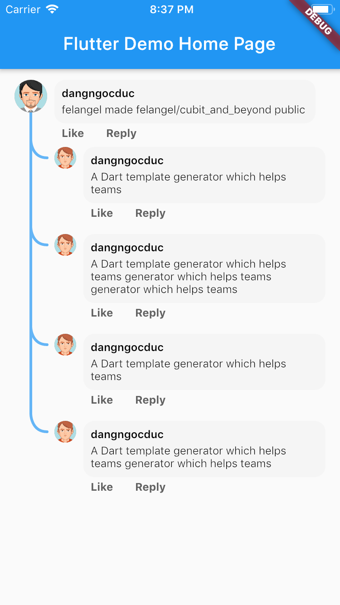
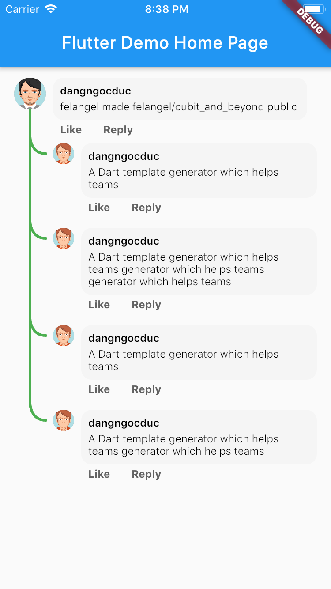

# comment_tree

A new Flutter package.

## Getting Started
```dart
Container(
    child: CommentTreeWidget<Comment, Comment>(
      Comment(...),
      [
        Comment(...),
      ],
      treeThemeData: TreeThemeData(
        lineColor: Colors.green[500],
        lineWidth: 3
      ),
      avatarRoot: (context, data) => PreferredSize(
        child: CircleAvatar(
          radius: 18,
          backgroundColor: Colors.grey,
          backgroundImage: AssetImage('assets/avatar_2.png'),
        ),
        preferredSize: Size.fromRadius(18),
      ),
      avatarChild: (context, data) => PreferredSize(
        child: CircleAvatar(
          radius: 12,
          backgroundColor: Colors.grey,
          backgroundImage: AssetImage('assets/avatar_1.png'),
        ),
        preferredSize: Size.fromRadius(12),
      ),
      contentChild: (context, data) {
          return ...;
      },
      contentRoot: (context, data) {
         return ...;
    ),
    padding: EdgeInsets.symmetric(vertical: 12, horizontal: 16),
)
```

## Demo
|                             |                             |                             |
|:----------------------------|:----------------------------|:----------------------------|
|    |  |  |
