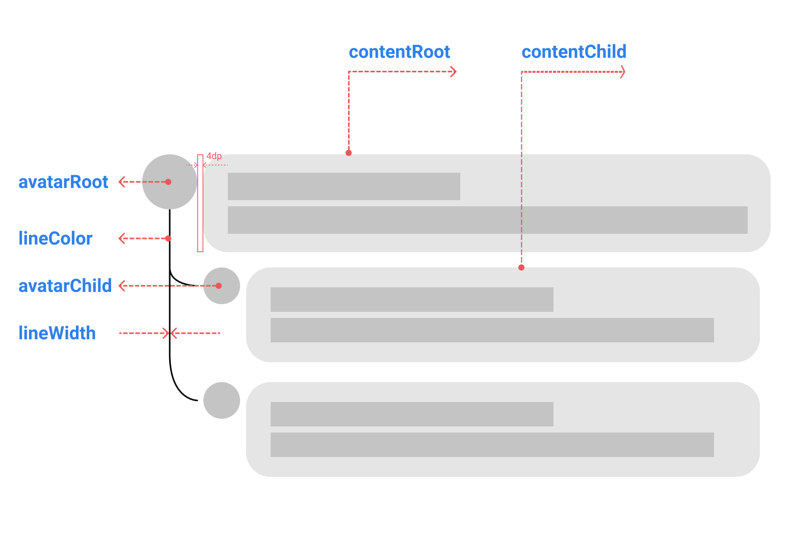

# comment_tree
<p align="center">

  <a href="https://pub.dartlang.org/packages/comment_tree">
    
  </a>
  <br/>
  <a href="https://github.com/dangngocduc/comment_tree">
    
  </a>
  <a href="https://github.com/tenhobi/effective_dart">
    
  </a>
  <a href="https://opensource.org/licenses/MIT">
    
  </a>
</p>

A new Flutter package.

## Getting Started
```dart
CommentTreeWidget<Comment, Comment>(
      ...
      treeThemeData: TreeThemeData(
        lineColor: Colors.green[500],
        lineWidth: 3
      ),
      avatarRoot: (context, data) => PreferredSize(...),
      avatarChild: (context, data) => PreferredSize(...),
      contentChild: (context, data) {
          return ...;
      },
      contentRoot: (context, data) {
         return ...;
      })
```
## Design



## Demo
|                             |                             |                             |
|:----------------------------|:----------------------------|:----------------------------|
|    |  |  |
